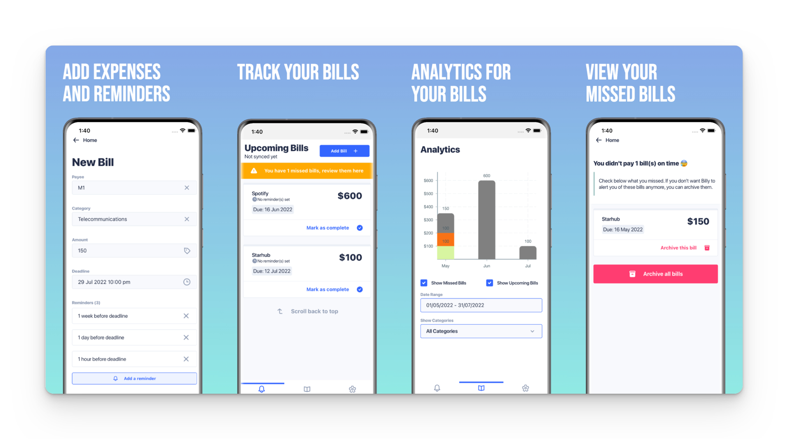

# Billy <!-- omit in toc -->

  </img>

  <a href="https://github.com/lyqht/Billy/actions/workflows/update-types.yml"></img></a>

    <a href="https://play.google.com/store/apps/details?id=com.lyqht.billy">Beta Track release on Google Play ▶️</a> 

  

    <a href="#introduction-">Introduction 🌱</a>
    •
    <a href="./CONTRIBUTING.md">Contributing ✨</a>
    •
    <a href="#tech-notes-">Tech Notes 🗒</a>
  

## Introduction 🌱

Billy is your mobile companion app to help you manage your upcoming bills and remind you when they're due. Say goodbye to late payment fees!

  </img>

 

- If you are keen on how the app idea came about, you can refer to the [section on how it started](https://lyqht.github.io/Billy/docs/roadmap/how_it_started).
- Live progress on this project can be tracked via [the main dev's tweets](https://twitter.com/search?q=Billy%20(from%3Aestee_tey)&src=typed_query&f=top).  
- For more in-depth details on planned & implemented features, you could refer to [ROADMAP.md](https://github.com/lyqht/Billy/blob/main/docs/docs/roadmap/checklist.mdx).

## Tech Notes 🗒

### Building blocks of this project 🧱

- [UI Kittens](https://github.com/akveo/react-native-ui-kitten) for UI components
- [Supabase](https://github.com/supabase/supabase) for Database & Auth. Data is served by REST.
- [React Native MMKV](https://github.com/mrousavy/react-native-mmkv) for caching
- [Notifee](https://github.com/invertase/notifee) for creating notifications
- [Victory](https://github.com/FormidableLabs/victory) for creating charts
- [Custom GitHub action for generating Supabase database types](https://blog.esteetey.dev/how-to-create-and-test-a-github-action-that-generates-types-from-supabase-database)
- [Custom Web Scraper for getting Singapore Billing Organisations](https://github.com/lyqht/sg-bill-org-scraper) for populating payee options

If you are interested on other aspects of how this app is built (e.g. how the app is bootstrapped, tech architecture, mockup etc), check out [Billy's documentation](https://lyqht.github.io/Billy/).

## Contributing

Please refer to [CONTRIBUTING.md](./CONTRIBUTING.md) for contribution guidelines and setup instructions.