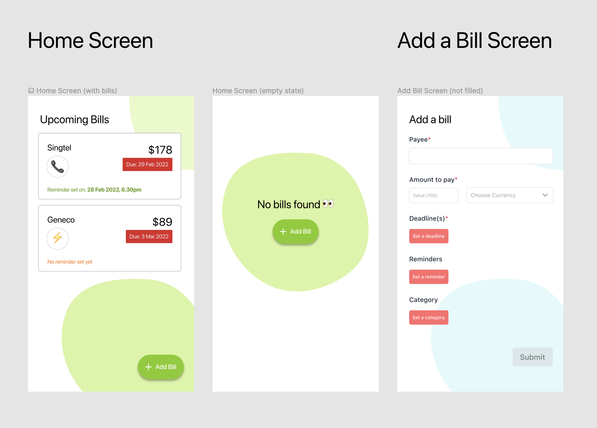
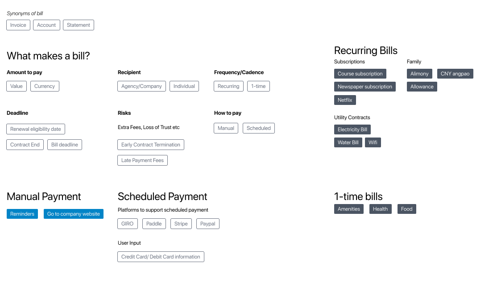
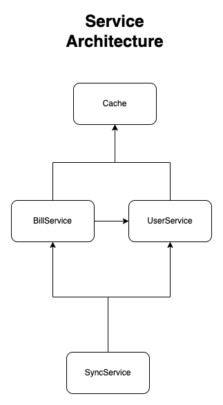

# Misc Tech Notes <!-- omit in toc -->

- [How this project is created](#how-this-project-is-created)
- [Initial Mock up](#initial-mock-up)
- [Content Models](#content-models)
- [Tech Architecture](#tech-architecture)
- [Random stuff learnt along the way](#random-stuff-learnt-along-the-way)

## How this project is created

This project is bootstrapped by 
```
npx react-native init Billy --template @ui-kitten/template-ts
```

Many things have been heavily modified since then!

## Initial Mock up



Yes it looks a lot different from then! The original figma mockup is made using Native Base's Figma kit — and now I'm not even using Native Base component library. This mockup gave me sufficient ideas on what I want to display that I didn't feel a need to create a new one.

## Content Models

These are some brief ideations of the content models and entities that could be in Billy. Billy still has a long way to go \m/ although probably not everything would be in v1.0.0 of production release.



## Tech Architecture


## Random stuff learnt along the way

- UI Kittens does not come with FABs, so had to change design
- Supabase requires `react-native-url-polyfill` on React Native to work ([Reference](https://justinnoel.dev/2020/12/08/react-native-urlsearchparams-error-not-implemented/))
- If creating DB on Supabase that is imported from spreadsheet, the autoincrement index needs to be manually reset. ([Reference](https://github.com/supabase/supabase/issues/1804))
- For using custom storage provider with Supabase on React Native, we have to declare an interface that resembles Async Storage ([Reference](https://github.com/supabase/supabase/issues/6348))
- Integrating UI Kittens Select component with React Hook Form ([Reference](https://github.com/react-hook-form/react-hook-form/discussions/8187))
- Detox
  - Should create builds in release for E2E rather than in debug mode for detox ([Reference](https://github.com/wix/Detox/issues/1382))